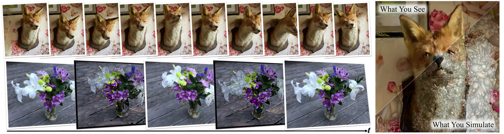

# PhysGaussian: Physics-Integrated 3D Gaussians for Generative Dynamics

### [[Project Page](https://xpandora.github.io/PhysGaussian/)] [[arXiv](https://arxiv.org/abs/2311.12198)] [[Video](https://www.youtube.com/watch?v=V96GfcMUH2Q)]

Tianyi Xie<sup>1</sup>\*, Zeshun Zong<sup>1</sup>\*, Yuxing Qiu<sup>1</sup>\*, Xuan Li<sup>1</sup>\*, Yutao Feng<sup>2,3</sup>, Yin Yang<sup>3</sup>, Chenfanfu Jiang<sup>1</sup>
<sup>1</sup>University of California, Los Angeles, <sup>2</sup>Zhejiang University, <sup>3</sup>University of Utah <br>
*Equal contributions



Abstract: *We introduce PhysGaussian, a new method that seamlessly integrates physically grounded Newtonian dynamics within 3D Gaussians to achieve high-quality novel motion synthesis. Employing a customized Material Point Method (MPM), our approach enriches 3D Gaussian kernels with physically meaningful kinematic deformation and mechanical stress attributes, all evolved in line with continuum mechanics principles. A defining characteristic of our method is the seamless integration between physical simulation and visual rendering: both components utilize the same 3D Gaussian kernels as their discrete representations. This negates the necessity for triangle/tetrahedron meshing, marching cubes, ''cage meshes,'' or any other geometry embedding, highlighting the principle of ''what you see is what you simulate (WS2).'' Our method demonstrates exceptional versatility across a wide variety of materials--including elastic entities, plastic metals, non-Newtonian fluids, and granular materials--showcasing its strong capabilities in creating diverse visual content with novel viewpoints and movements.*

## News

- [2023-12-20] Our [MPM solver code](https://github.com/zeshunzong/warp-mpm) is open sourced!

## TODO

- Full code release. (coming soon)
- Colab script.

## Citation

```
@article{xie2023physgaussian,
      title={PhysGaussian: Physics-Integrated 3D Gaussians for Generative Dynamics}, 
      author={Xie, Tianyi and Zong, Zeshun and Qiu, Yuxing and Li, Xuan and Feng, Yutao and Yang, Yin and Jiang, Chenfanfu},
      journal={arXiv preprint arXiv:2311.12198},
      year={2023},
}
```